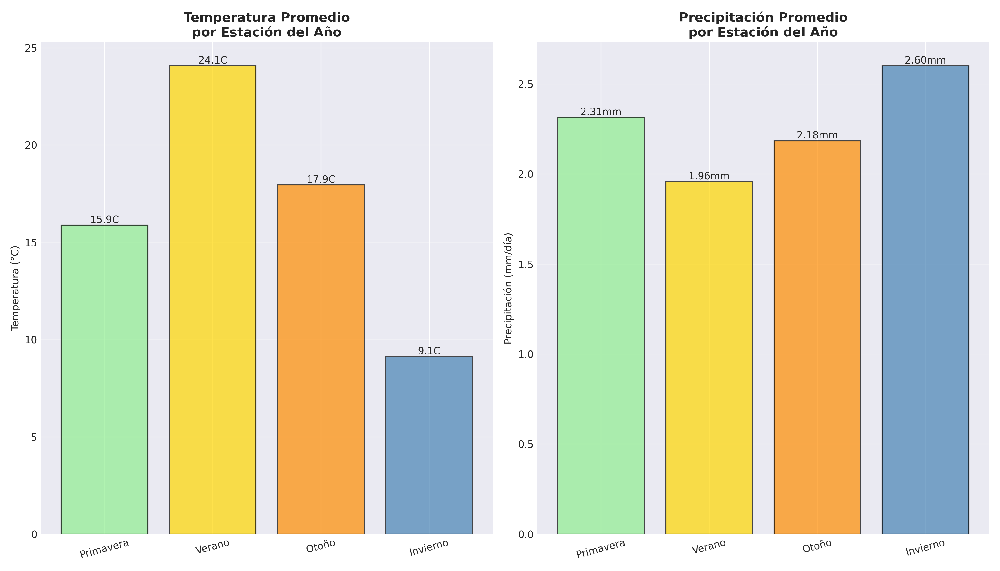
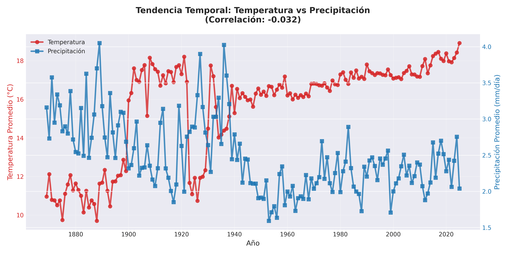

# Proyecto 2: Análisis Climático con PySpark

Análisis de datos meteorológicos de NOAA utilizando Apache PySpark para el curso de Bases de Datos no Relacionales (ITAM).

## Descripción

Este proyecto procesa y analiza más de 0.5 GB de datos climáticos históricos del **Global Historical Climatology Network (GHCN-Daily)** de NOAA, realizando 5 procesamientos diferentes:

1. **Temperatura Promedio Mensual** - Estadísticas mensuales por estación
2. **Precipitación Anual** - Totales y variabilidad anual
3. **Extremos Climáticos** - Récords de temperatura por ubicación
4. **Análisis Estacional** - Comparación entre estaciones del año
5. **Tendencias Temporales** - Evolución y correlación de variables

## Requisitos Previos

- Python 3.8 o superior
- Java 8 o superior (requerido por Apache Spark)
- Git
- 2 GB de espacio en disco disponible

## Instalación

### Método 1: Instalación Local

```bash
# Clonar repositorio
git clone https://github.com/lafarch/proyecto2-pyspark-clima.git
cd proyecto2-pyspark-clima

# Crear entorno virtual
python -m venv .venv

# Activar entorno virtual
# En Windows PowerShell:
.venv\Scripts\Activate.ps1
# En Windows CMD:
.venv\Scripts\activate.bat
# En Mac/Linux:
source .venv/bin/activate

# Instalar dependencias
pip install -r requirements.txt

# Verificar instalación
python utils.py
```

### Método 2: Usando Docker (Recomendado)

```bash
# Construir imagen
docker-compose build

# Verificar instalación
docker-compose run pyspark-app python utils.py
```

## Ejecución

### Usando Python Local

```bash
# Paso 1: Descargar datos de NOAA (10-15 minutos)
python descargar_datos_noaa.py

# Paso 2: Ejecutar análisis con PySpark (5-10 minutos)
python analisis_clima_pyspark.py

# Paso 3: Generar muestra del 5% para entrega
make muestra
# O alternativamente:
python -c "from utils import generar_muestra; from config import DATOS_PROCESADOS, MUESTRA_5PCT; generar_muestra(DATOS_PROCESADOS, MUESTRA_5PCT)"

# Ver resultados
ls resultados/
```

### Usando Docker

```bash
# Descargar datos
docker-compose run pyspark-app python descargar_datos_noaa.py

# Ejecutar análisis
docker-compose run pyspark-app python analisis_clima_pyspark.py

# Generar muestra 5%
docker-compose run pyspark-app make muestra

# Ver resultados (están en tu carpeta local)
ls resultados/

# Limpiar contenedores
docker-compose down
```

### Usando Makefile (Atajos)

```bash
# Ver todos los comandos disponibles
make help

# Instalar dependencias
make install

# Ejecutar pipeline completo (descarga + análisis)
make all

# Solo descargar datos
make download

# Solo ejecutar análisis
make analyze

# Generar muestra 5%
make muestra

# Limpiar archivos temporales
make clean

# Verificar instalación
make test
```

## Estructura del Proyecto

```
proyecto2-pyspark/
│
├── config.py                      # Configuración centralizada del proyecto
├── utils.py                       # Funciones auxiliares y utilidades
├── descargar_datos_noaa.py        # Script de descarga de datos de NOAA
├── analisis_clima_pyspark.py      # Script principal de análisis con PySpark
│
├── requirements.txt               # Dependencias de Python
├── .gitignore                     # Archivos ignorados por Git
├── README.md                      # Este archivo
├── INSTALL.md                     # Guía detallada de instalación
├── Makefile                       # Comandos automatizados
│
├── Dockerfile                     # Definición de imagen Docker
├── docker-compose.yml             # Orquestación de contenedores
│
├── .venv/                         # Entorno virtual (ignorado por Git)
│
├── datos/                         # Directorio de datos (ignorado por Git excepto muestra)
│   ├── datos_noaa/               # CSVs crudos descargados por estación
│   │   ├── USW00094728.csv       # Nueva York - Central Park
│   │   ├── USW00023174.csv       # Los Angeles
│   │   ├── USW00013874.csv       # Chicago
│   │   └── ...                   # Otras estaciones
│   │
│   ├── datos_clima_noaa.csv              # Datos unificados (generado)
│   ├── datos_clima_noaa_procesado.csv    # Datos limpios para PySpark (generado)
│   └── muestra_5porciento.csv            # Muestra del 5% para entrega (generado)
│
├── resultados/                    # Gráficas generadas por el análisis
│   ├── grafica_1_temp_mensual.png
│   ├── grafica_2_precipitacion.png
│   ├── grafica_3_extremos.png
│   ├── grafica_4_estacional.png
│   └── grafica_5_tendencia.png
│
└── docs/                          # Documentación del proyecto
    ├── documento_proyecto.docx    # Documento completo (10+ páginas)
    └── presentacion_proyecto.pptx # Presentación (6 diapositivas)
```

## Descripción de Archivos Principales

### Scripts Python

- **config.py**: Configuración centralizada con rutas, constantes y parámetros del proyecto
- **utils.py**: Funciones auxiliares para validación, conversión y utilidades generales
- **descargar_datos_noaa.py**: Descarga datos de NOAA, los unifica y prepara para PySpark
- **analisis_clima_pyspark.py**: Ejecuta los 5 procesamientos requeridos y genera gráficas

### Archivos de Configuración

- **requirements.txt**: Lista de paquetes Python necesarios
- **.gitignore**: Define qué archivos no se suben a Git (datos grandes, entorno virtual, etc.)
- **Makefile**: Automatiza comandos comunes (instalación, descarga, análisis, limpieza)
- **Dockerfile**: Define la imagen Docker con Python, Java y dependencias
- **docker-compose.yml**: Orquesta servicios Docker (app principal y Jupyter opcional)

## Procesamientos Implementados

### 1. Temperatura Promedio Mensual
Calcula estadísticas mensuales de temperatura por estación meteorológica:
- Promedio, máximo y mínimo mensuales
- Desviación estándar
- Número de observaciones

### 2. Precipitación Anual
Analiza la precipitación por año:
- Total anual acumulado
- Promedio diario
- Desviación estándar (variabilidad)
- Precipitación máxima registrada

### 3. Extremos Climáticos por Estación
Identifica récords por ubicación:
- Temperatura máxima histórica
- Temperatura mínima histórica
- Precipitación récord en un día
- Temperatura media general

### 4. Análisis Estacional
Compara variables climáticas por estación del año:
- Temperatura promedio (Primavera, Verano, Otoño, Invierno)
- Precipitación promedio por estación
- Rangos de temperatura

### 5. Tendencias Temporales y Correlación
Analiza evolución a largo plazo:
- Tendencia anual de temperatura
- Tendencia anual de precipitación
- Coeficiente de correlación entre temperatura y precipitación
- Visualización de ambas variables en gráfica de doble eje

## Resultados

El proyecto genera 5 gráficas en formato PNG (300 DPI):

| Gráfica | Descripción |
|---------|-------------|
| grafica_1_temp_mensual.png | Serie temporal de temperatura mensual |
| grafica_2_precipitacion.png | Precipitación anual y desviación estándar |
| grafica_3_extremos.png | Comparación de temperaturas extremas por estación |
| grafica_4_estacional.png | Patrones por estación del año |
| grafica_5_tendencia.png | Evolución temporal y correlación |

Todas las gráficas se guardan automáticamente en el directorio `resultados/`.

<p align="center">
  
  
</p>

<p align="center">
  
  
</p>

<p align="center">
  
</p>


## Tecnologías Utilizadas

- **Apache PySpark 3.5.0** - Framework de procesamiento distribuido de Big Data
- **Python 3.11** - Lenguaje de programación principal
- **Pandas 2.1.4** - Conversión de datos para visualización
- **Matplotlib 3.8.2** - Generación de gráficas
- **NumPy 1.26.2** - Operaciones numéricas
- **Docker** - Contenedorización (opcional)
- **NOAA GHCN-Daily** - Fuente de datos climáticos públicos

## Fuente de Datos

**Dataset**: Global Historical Climatology Network - Daily (GHCN-Daily)
**Proveedor**: NOAA (National Oceanic and Atmospheric Administration)
**URL**: https://www.ncei.noaa.gov/data/global-historical-climatology-network-daily/

**Características**:
- Registros diarios de temperatura y precipitación
- Más de 100,000 estaciones meteorológicas en todo el mundo
- Datos históricos desde 1763 hasta la actualidad
- Formato: CSV
- Cobertura: Este proyecto utiliza 10 estaciones principales de Estados Unidos

**Estaciones incluidas**:
- USW00094728 - New York (Central Park)
- USW00023174 - Los Angeles
- USW00013874 - Chicago O'Hare
- USW00012960 - Houston
- USW00023234 - Phoenix
- USC00045933 - Philadelphia
- USW00013881 - San Antonio
- USW00023188 - San Diego
- USW00013960 - Dallas
- USW00012919 - Austin

## Documentación

- [Guía de instalación detallada](INSTALL.md) - Instrucciones paso a paso para configurar el entorno
- [Documento completo del proyecto](docs/documento_proyecto.md) - Informe académico de 10+ páginas
- [Presentación del proyecto](docs/presentacion_proyecto.md) - Slides de presentación (6 diapositivas)

## Licencia

Este proyecto es parte del curso de Bases de Datos no Relacionales del ITAM (2025).

## Referencias

- NOAA National Centers for Environmental Information. (2025). Global Historical Climatology Network - Daily (GHCN-Daily). https://www.ncei.noaa.gov/products/land-based-station/global-historical-climatology-network-daily
- Apache Software Foundation. (2025). Apache Spark Documentation. https://spark.apache.org/docs/latest/
- Zaharia, M., et al. (2016). Apache Spark: A Unified Engine for Big Data Processing. Communications of the ACM, 59(11), 56-65.

## Agradecimientos

- Dr. Felipe López G. - Profesor del curso de Bases de Datos no Relacionales
- NOAA - Por proporcionar datos climáticos de acceso público
- Apache Software Foundation - Por el desarrollo de Apache Spark

---

**Instituto Tecnológico Autónomo de México (ITAM)**  
**Bases de Datos no Relacionales - 2025**

---

## Solución de Problemas

### Error: "Java not found"

```bash
# Verificar instalación de Java
java -version

# Si no está instalado:
# Windows (con Chocolatey):
choco install openjdk11

# Mac (con Homebrew):
brew install openjdk@11

# Linux (Ubuntu/Debian):
sudo apt-get install openjdk-11-jdk
```

### Error: "Module 'pyspark' not found"

```bash
# Asegurarse de estar en el entorno virtual
source .venv/bin/activate  # Mac/Linux
.venv\Scripts\activate     # Windows

# Reinstalar dependencias
pip install -r requirements.txt
```

### Error: GitHub rechaza push por archivo grande

Los datos completos NO deben subirse a GitHub. Asegúrate de que `.gitignore` está configurado correctamente:

```bash
# Verificar que los datos están ignorados
git status

# Si aparecen archivos grandes, eliminarlos del staging
git rm --cached datos/*.csv
git commit -m "Remove large data files"
```

### Archivos temporales de Spark

```bash
# Limpiar archivos temporales
make clean

# O manualmente:
rm -f derby.log
rm -rf metastore_db spark-warehouse
```
